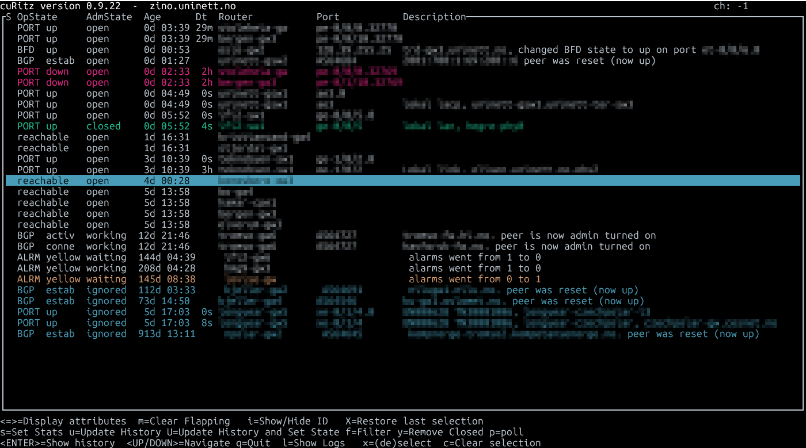

.. _curitz:

======
cuRitz
======
cuRitz provides a terminal-based user interface to interact with your Zino server.
Installation and configuration of cuRitz is further described on its `GitHub page <https://github.com/Uninett/curitz>`_.

User interface
--------------

The UI displays states and alarms of monitored equipment/ports in your network, these are referred to as an "event" or a "case". All events are ordered chronologically from bottom to top, allowing the event with the most recent operational state change to be at the top of the event list.

Polled information regarding each event is divided into columns. In addition to polled information, each event can be updated from the user side with comments and working states.

Column descriptors
__________________

:*OpState*:
        Operational state, consists of affected unit and/or state of unit.
:*AdmState*:
        Administrative state, set by user to indicate current state in workflow.
:*Age*:
        Time since event first appeared.
:*Dt*:
        Downtime, total time without connectivity since start of event.
:*Router*:
        Source of event (equipment).
:*Port*:
        Source of event (port). Displays AS-number, or IP for BGP and BFD events.
:*Description*:
        Port or event description.

States
______

The operational (*OpState*) and administrative state (*AdmState*) determine the color and behaviour of an event row.

   cuRitz displaying several events with different OpStates and AdmStates. Sensitive information has been blurred.

OpState
.......

The *OpState* column holds the current state of the affected equipment, corresponding to one of the following values:

- PORT down/lower/open
- BGP  down/activ/conne/estab
- BFD down/up
- ALRM yellow/red
- no-response/reachable

AdmState
........

The *AdmState* column holds the current state of the event lifecycle. 

.. include:: /_shared/event_lifecycle.rst

The *embryonic* state is internal to the server and
will never be visible in cuRitz.

Color and behaviour
...................

The event row color is determined by one of the following combinations:

+----------------+------------------------+--------+
| OpState        | AdmState               | Color  |
+================+========================+========+
| Open           | | PORT down/lower      | red    |
|                | | BGP down             |        |                
|                | | BFD down             |        |
|                | | no-response          |        |
|                | | ALRM yellow/red > 0  |        |
+----------------+------------------------+--------+
| Open           | | PORT open            | white  |
|                | | BGP activ/conne/estab|        |
|                | | BFD up               |        |
|                | | reachable            |        |
|                | | ALRM yellow/red = 0  |        |
+----------------+------------------------+--------+
| Working/waiting| | PORT down/lower      | yellow |
|                | | BGP down             |        |
|                | | BFD down             |        |
|                | | no-response          |        |
|                | | ALRM yellow/red > 0  |        |
+----------------+------------------------+--------+
| Confirm-wait   | any state              | white  |
+----------------+------------------------+--------+
| Ignored        | any state              | blue   |
+----------------+------------------------+--------+
| Closed         | any state              | green  |
+----------------+------------------------+--------+

It's worth noting that the behaviour of an ALRM yellow/red event row is not decided by the *OpState*, but rather the number of active alarms, as visible in its *Description* column.

Closed events are automatically cleared upon closing cuRitz or by pressing *y*. The state of a closed event cannot be changed.

Ignored events are pinned to the bottom of the UI regardless of *OpState* changes.

.. tip::
   The default cursor is a blue line spanning all columns. If you prefer a simpler cursor, use the ``--arrow`` flag when starting cuRitz.

Workflow
--------

Navigate cuRitz using the UP and DOWN arrow keys, Page Up and Page Down can be used to move to the top and bottom of the event list.

The bottom of the terminal window displays possible actions and their corresponding keys.
The following workflow presents some of the most used keys:

- Investigate an event by looking at logs *(press l)*

  .. image:: curitz-images/log.png

- Investigate history - has anyone left any comments on the event? *(press ENTER)*
- Add a comment to the event, this will appear with a timestamp in the events' history *(press u)*

  .. image:: curitz-images/comment.png

  .. image:: curitz-images/history.png

- Change *AdmState* to indicate current step in process *(press s)*

  .. image:: curitz-images/statechange.png

- Optionally: add a comment and change *AdmState* simultaneously *(press U)*

        - i.e. "Currently investigating", change state to "Working"
        - i.e. "Caused by power outage", change state to "Closed"

- Clear all closed events *(press y)*

To update *AdmState* and/or add a comment to more than one event, select using *x* before pressing *u*, *s* or *U*. Selected events are marked by an asterisk. To deselect, press *x* again or *c* to deselect everything.

Events can be filtered based on description. Press *f* and type to filter, press *f* again and remove query to remove filter.

All actions can be cancelled using *Ctrl+C*.
